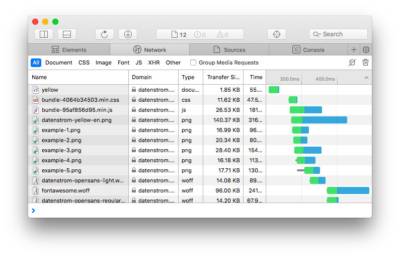

<p align="right"><a href="README-de.md">Deutsch</a> &nbsp; <a href="README.md">English</a> &nbsp; <a href="README-sv.md">Svenska</a></p>

# Bundle 0.8.32

Webseiten-Dateien bündeln.

<p align="center"></p>

## Wie man eine Erweiterung installiert

[ZIP-Datei herunterladen](https://github.com/annaesvensson/yellow-bundle/archive/refs/heads/main.zip) und in dein `system/extensions`-Verzeichnis kopieren. [Weitere Informationen zu Erweiterungen](https://github.com/annaesvensson/yellow-update/tree/main/README-de.md).

## Wie man Webseiten-Dateien bündelt

Diese Erweiterung bündelt und verkleinert Dateien für eine bessere Ladezeit. Deine Webseite enthält möglicherweise mehrere CSS- und JavaScript-Dateien. In der Regel werden die im Browser zwischengespeichert, trotzdem muss jede Datei überprüft werden. Hier kommt der Dateibündler ins Spiel. Er sucht im HTML-Header nach eingebundenen Dateien und ersetzt diese durch eine einzelne Datei für CSS und eine für JavaScript.

Falls du nicht willst dass eine Datei gebündelt wird, kannst du `data-bundle="exclude"` im HTML-Header angeben.

## Beispiele

Webseite mit ungebündelten CSS- und JavaScript-Dateien:

```
<!DOCTYPE html>
<html>
<head>
<title>Example page</title>
<link rel="stylesheet" type="text/css" media="all" href="/media/extensions/gallery.css" />
<link rel="stylesheet" type="text/css" media="all" href="/media/extensions/icon.css" />
<link rel="stylesheet" type="text/css" media="all" href="/media/themes/stockholm.css" />
<script type="text/javascript" defer="defer" src="/media/extensions/gallery-photoswipe.min.js"></script>
<script type="text/javascript" defer="defer" src="/media/extensions/gallery.js"></script>
</head>
<body>
<h1>Hello world</h1>
</body>
</html>
```

Webseite mit gebündelten CSS- und JavaScript-Dateien:

```
<!DOCTYPE html>
<html>
<head>
<title>Example page</title>
<link rel="stylesheet" type="text/css" media="all" href="/media/extensions/bundle-dfd1ef8a4c.min.css" />
<script type="text/javascript" defer="defer" src="/media/extensions/bundle-3808f805bc.min.js"></script>
</head>
<body>
<h1>Hello world</h1>
</body>
</html>
```

Webseite mit gebündelten und ungebündelten Dateien:

```
<!DOCTYPE html>
<html>
<head>
<title>Example page</title>
<link rel="stylesheet" type="text/css" media="all" href="/media/extensions/bundle-dfd1ef8a4c.min.css" />
<script type="text/javascript" defer="defer" src="/media/extensions/bundle-3808f805bc.min.js"></script>
<script type="text/javascript" defer="defer" data-bundle="exclude" src="/media/extensions/debug.js"></script>
</head>
<body>
<h1>Hello world</h1>
</body>
</html>
```

## Danksagung

Diese Erweiterung enthält [Minify 1.3.68](https://github.com/matthiasmullie/minify) von Matthias Mullie. Danke für die gute Arbeit.

## Entwickler

Anna Svensson. [Hilfe finden](https://datenstrom.se/de/yellow/help/).
